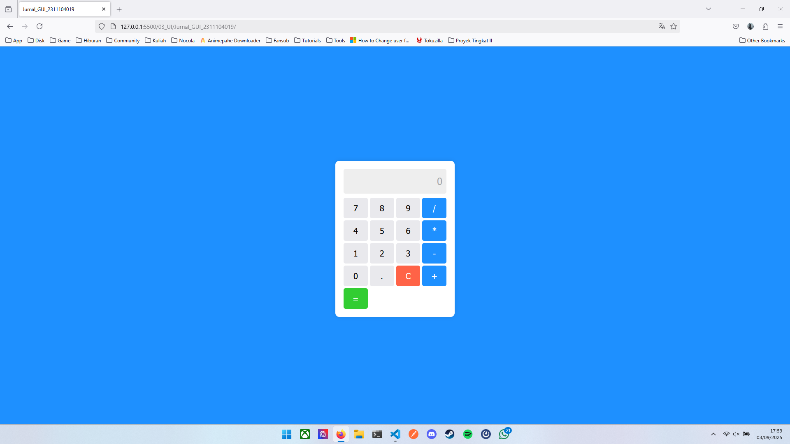
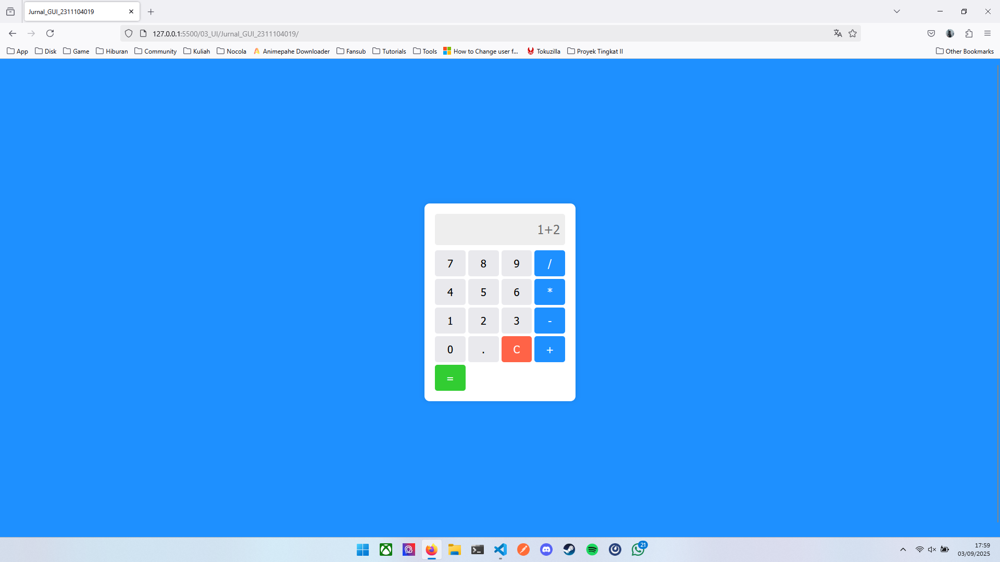

# Jurnal_GUI_2311104019

## Source Code

[index.html](https://)

## Output



Tampilan awal program.



Menginputkan angka pada form.


Tampilan setelah menekan tombol sama dengan.

## Penjelasan

```html
<div class="calculator">
    <!-- Elemen input untuk menginputkan angka yang akan dihitung sekaligus sebagai media output -->
    <input type="text" class="screen" id="screen" placeholder="0" disabled>
    
    <!-- Button group -->
    <div class="buttons">
        <button onclick="appendNumber('7')">7</button>
        <button onclick="appendNumber('8')">8</button>
        <button onclick="appendNumber('9')">9</button>
        <button class="operator" onclick="appendOperator('/')">/</button>
        <button onclick="appendNumber('4')">4</button>
        <button onclick="appendNumber('5')">5</button>
        <button onclick="appendNumber('6')">6</button>
        <button class="operator" onclick="appendOperator('*')">*</button>
        <button onclick="appendNumber('1')">1</button>
        <button onclick="appendNumber('2')">2</button>
        <button onclick="appendNumber('3')">3</button>
        <button class="operator" onclick="appendOperator('-')">-</button>
        <button onclick="appendNumber('0')">0</button>
        <button onclick="appendNumber('.')">.</button>
        <button class="clear" onclick="clearScreen()">C</button>
        <button class="operator" onclick="appendOperator('+')">+</button>
        <button class="equal" onclick="calculateResult()" colspan="4">=</button>
    </div>
</div>
```

```js
// Ambil elemen layar kalkulator
let screen = document.getElementById("screen");
let currentInput = "";

// Fungsi untuk menambahkan angka ke layar
function appendNumber(number) {
    currentInput += number;
    screen.value = currentInput;
}

// Fungsi untuk menambahkan operator matematika
function appendOperator(operator) {
    if (currentInput !== "" && !isNaN(currentInput[currentInput.length - 1])) {
        currentInput += operator;
        screen.value = currentInput;
    }
}

// Fungsi untuk menghapus seluruh input
function clearScreen() {
    currentInput = "";
    screen.value = "";
}

// Fungsi untuk menghitung hasil ekspresi matematika
function calculateResult() {
    try {
        currentInput = eval(currentInput).toString(); // Menggunakan eval untuk menghitung ekspresi
        screen.value = currentInput;
    } catch (error) {
        screen.value = "Error"; // Menampilkan error jika terjadi kesalahan input
        currentInput = "";
    }
}
```
