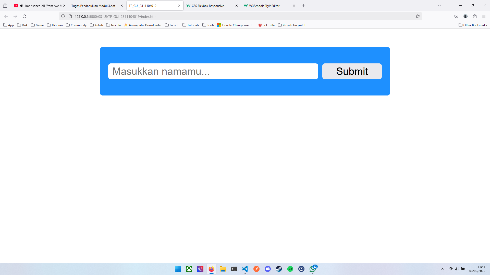
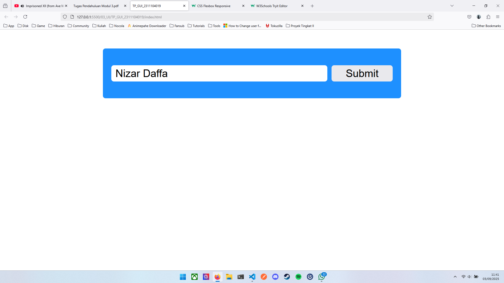
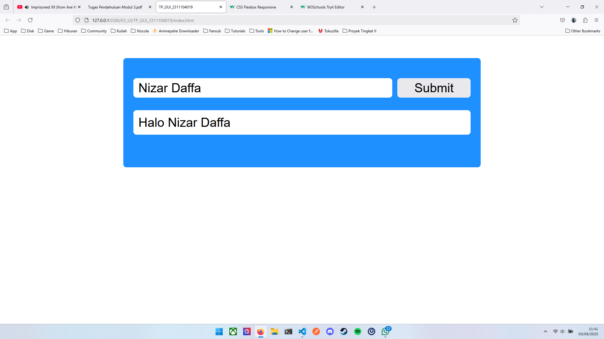

# TP_GUI_2311104019

## Source Code

```html
<main class="container">
    <form id="myForm">
        <div class="btn-group">
            <input type="text" name="nama" id="nama" placeholder="Masukkan namamu...">
            <button type="submit">Submit</button>
        </div>
        <p id="output"></p>
    </form>
</main>

<script>
    const myForm = document.getElementById('myForm');
    const output = document.getElementById('output');

    myForm.addEventListener('submit', (e) => {
        e.preventDefault();

        output.style.display = 'block';
        output.innerText = `Halo ${myForm.nama.value}`;
    });
</script>
```

## Output



Tampilan awal program.



Menginputkan nama pada form.



Tampilan setelah menekan tombol submit.

## Penjelasan

```html
<main class="container">
    <form id="myForm">
        <div class="btn-group">
            <input type="text" name="nama" id="nama" placeholder="Masukkan namamu...">
            <button type="submit">Submit</button>
        </div>
        <p id="output"></p>
    </form>
</main>
```

- `<form id="myForm">...</form>` : Membuat elemen form dengan id `myForm`.
- `<div class="btn-group">...</div>` : Membuat elemen `div` sebagai *container* elemen input dan submit.
- `<input type="text" ...>` : Membuat elemen `input` dengan tipe `text`.
- `<button type="submit">...</button>` : Membuat elemen `button` dengan tipe `submit` untuk mengirimkan form.
- `<p id="output"></p>` : Membuat elemen paragraf dengan id `output` untuk menampung output yang dihasilkan oleh program.

```js
const myForm = document.getElementById('myForm');
const output = document.getElementById('output');

myForm.addEventListener('submit', (e) => {
    e.preventDefault();

    output.style.display = 'block';
    output.innerText = `Halo ${myForm.nama.value}`;
});
```

- `const myForm = document.getElementById('myForm');` : Menyimpan elemen form dengan id `myForm` kedalam variabel `myForm`.
- `const output = document.getElementById('output');` : Menyimpan elemen dengan id `output` kedalam variabel `output`.
- `myForm.addEventListener('submit', (e) => {...});` : Menambahkan event listener pada elemen form ketika *submit*.
- `e.preventDefault();` : Untuk mencegah form supaya halaman tidak reload ketika form disubmit.
- `output.style.display = 'block';` : Untuk menampilkan elemen `output` yang awalnya memiliki display `none`.
- `output.innerText = Halo ${myForm.nama.value};` : Mengubah text di dalam elemen output untuk menampilkan teks `Halo ${myForm.nama.value}`.
