# Jurnal API 2311104019

## Demonstrasi OpenAPI

### Tampilan Awal OpenAPI

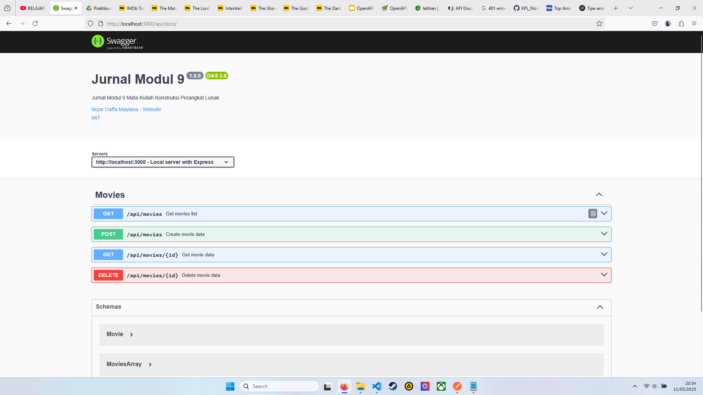

### Get All Movies

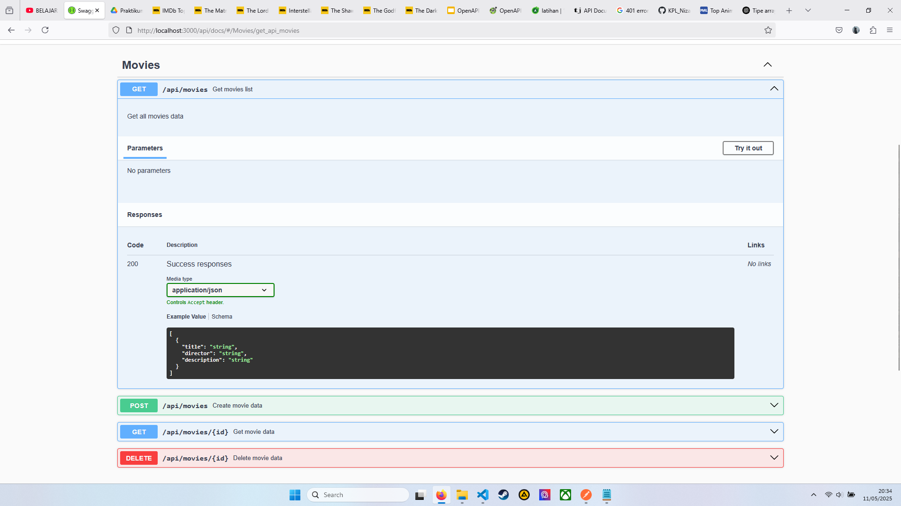

Setelah Execute.

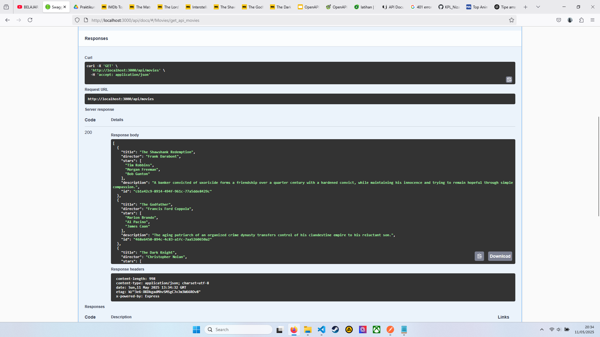

### Create Movie

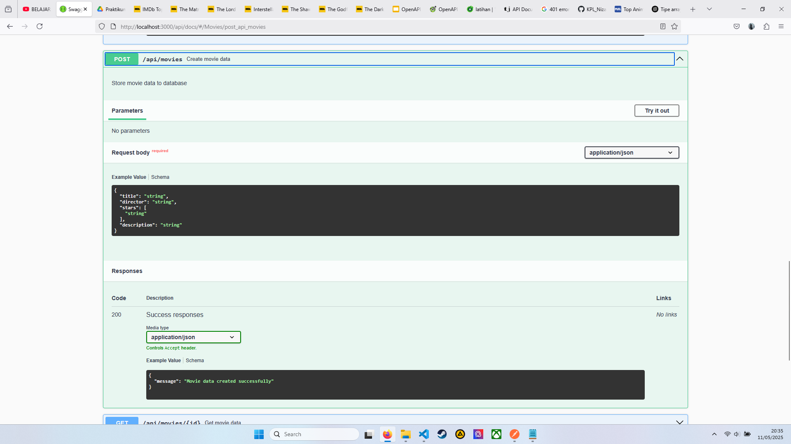

Setelah Execute.

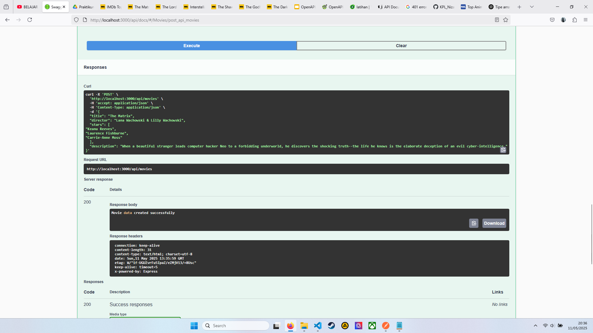

Get All Movies setelah Create Movie.

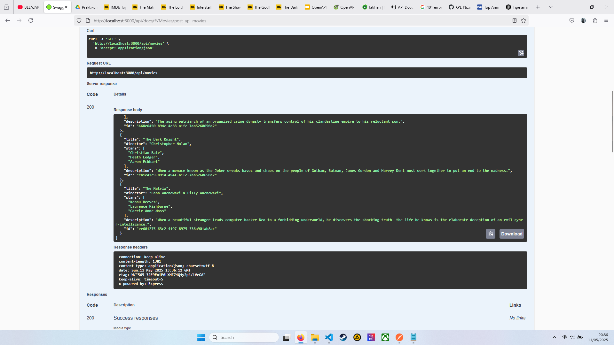

### Get Movie

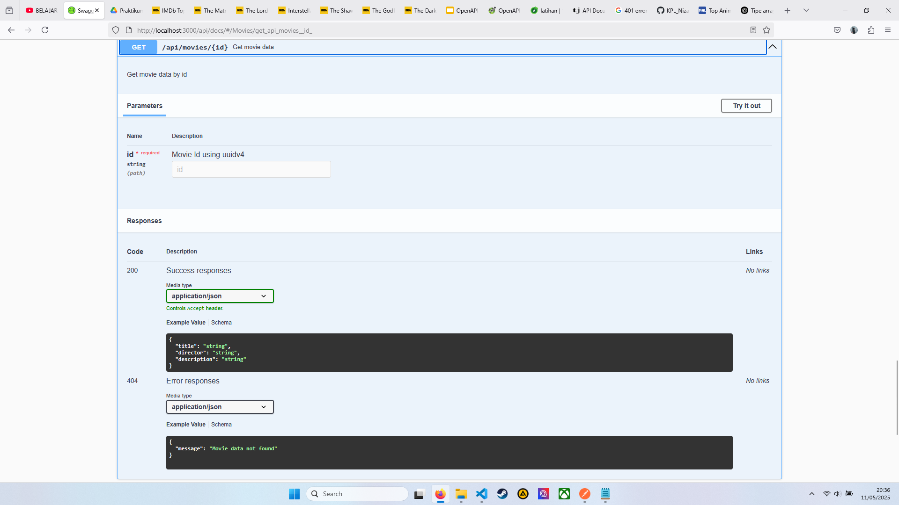

Setelah Execute.

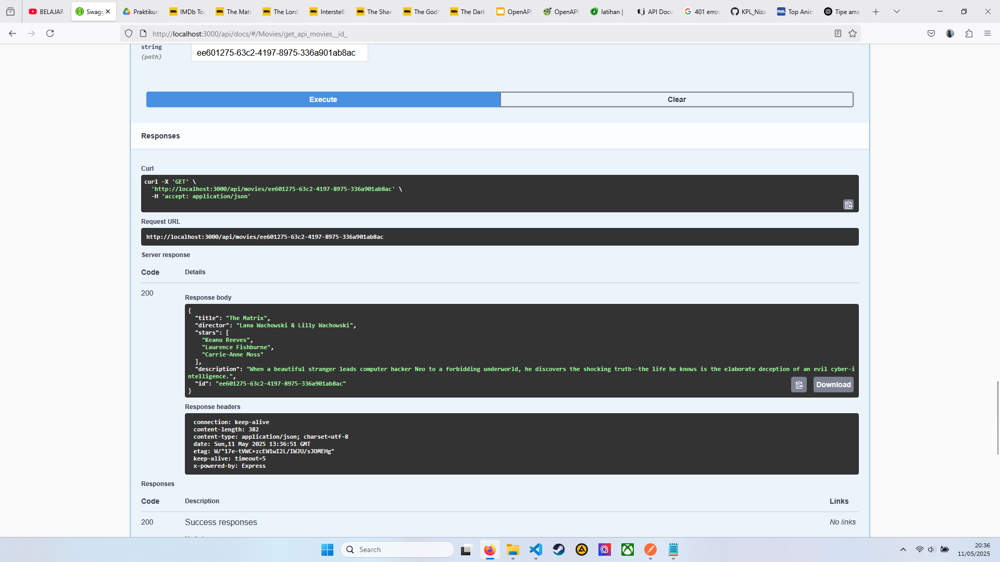

### Delete Movie

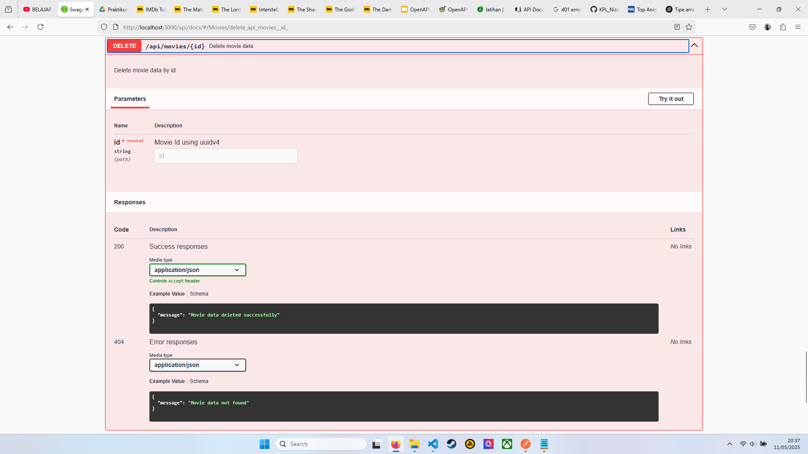

Setelah Execute.

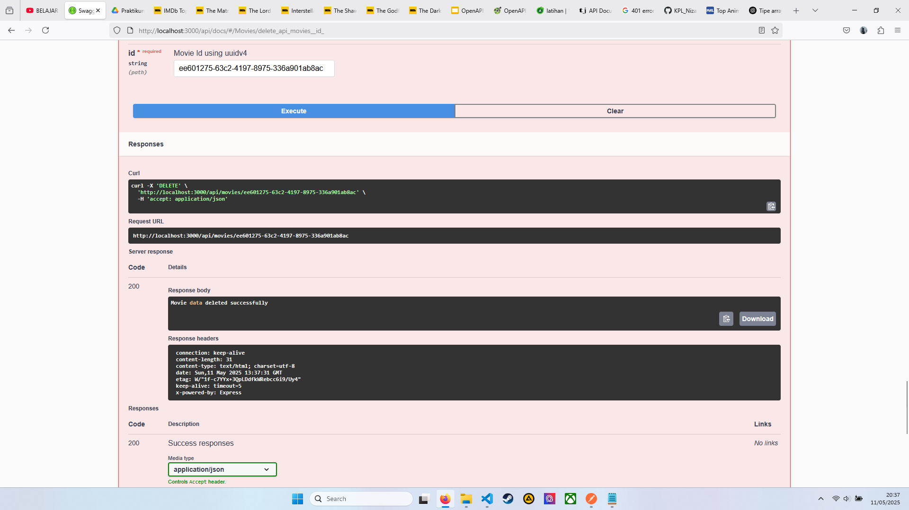

Get All Movies setelah Delete Movie.

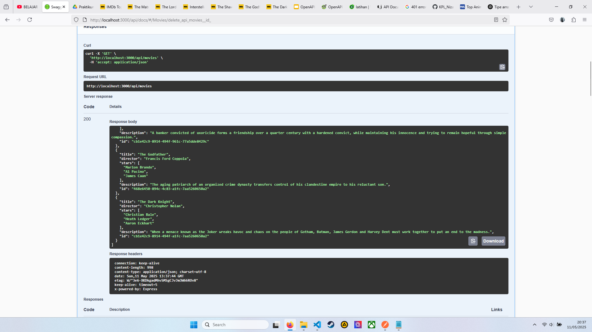
