# TP API 2311104019

## Demonstrasi OpenAPI

### Tampilan Awal OpenAPI

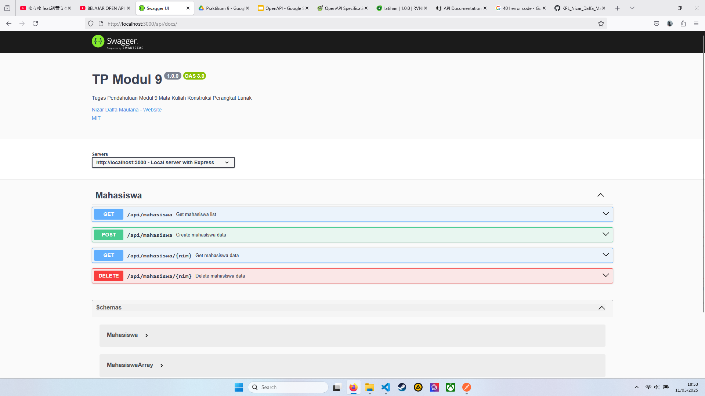

### Get All Mahasiswa

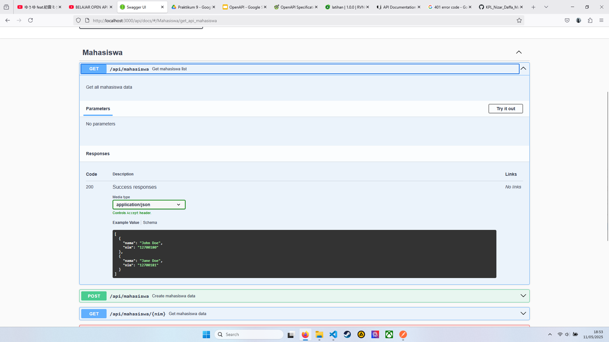

Setelah Execute.

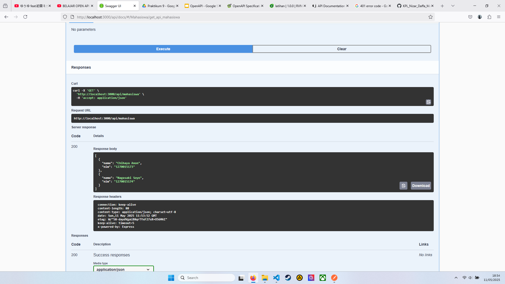

### Create Mahasiswa

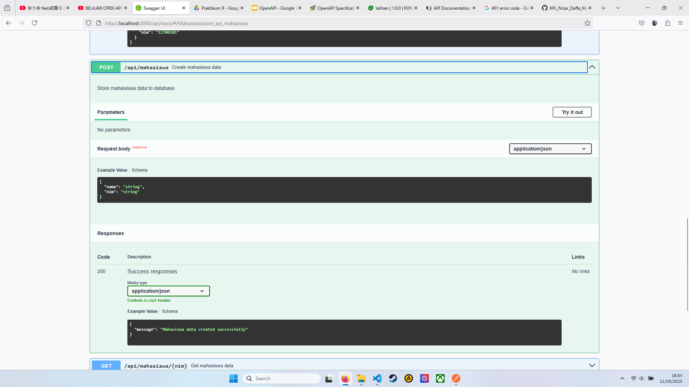

Setelah Execute.

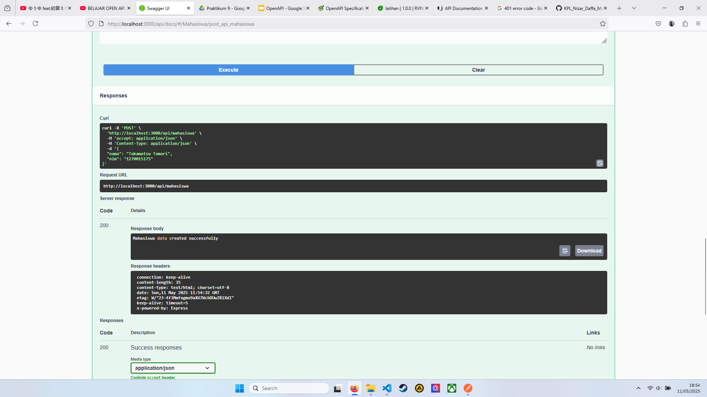

Get All Mahasiswa setelah Create Mahasiswa.

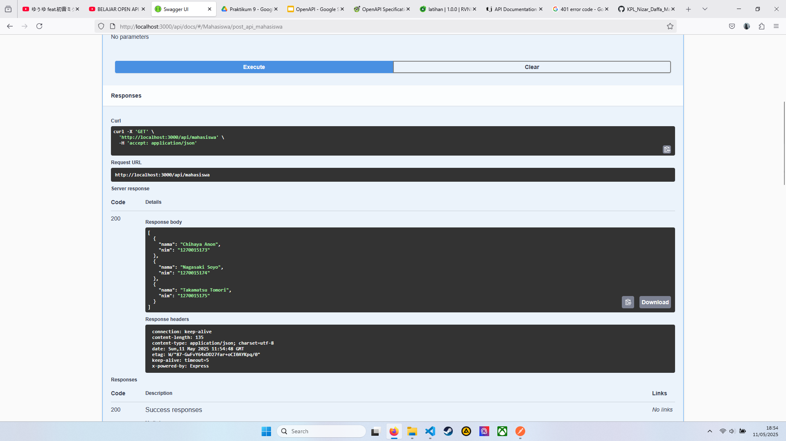

### Get Mahasiswa

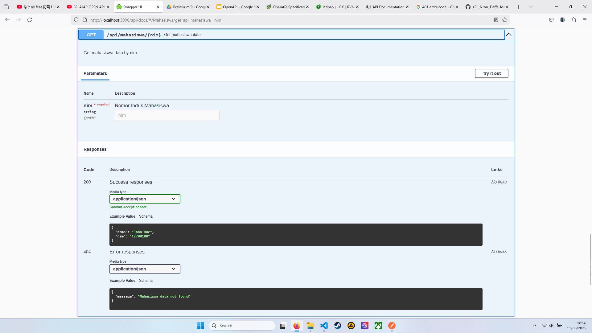

Setelah Execute.

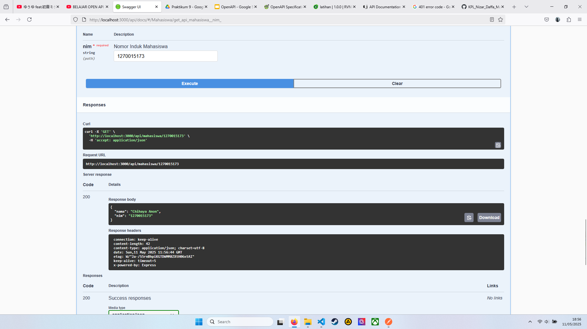

### Delete Mahasiswa

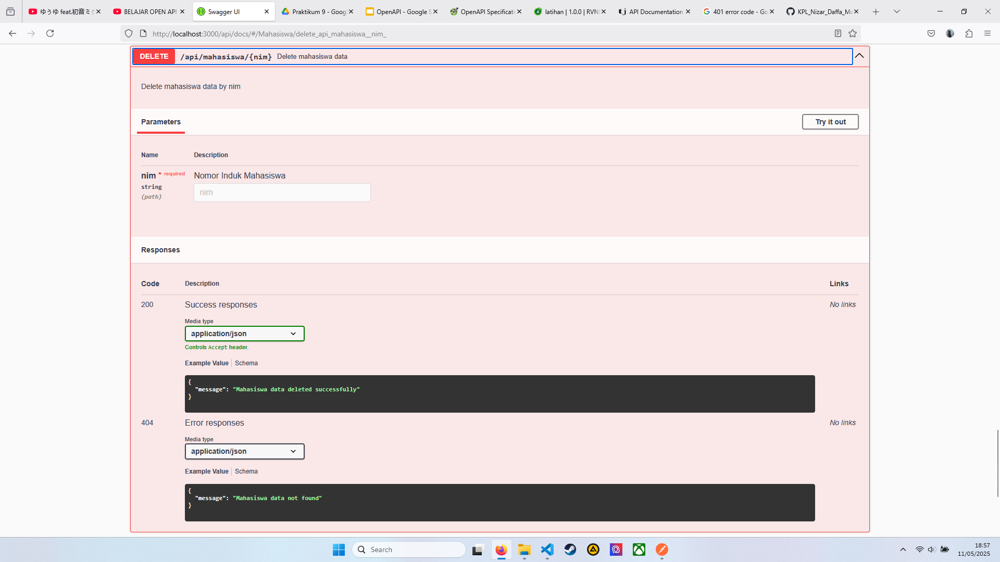

Setelah Execute.

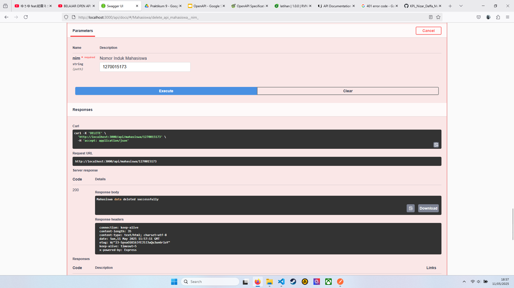

Get All Mahasiswa setelah Delete Mahasiswa.

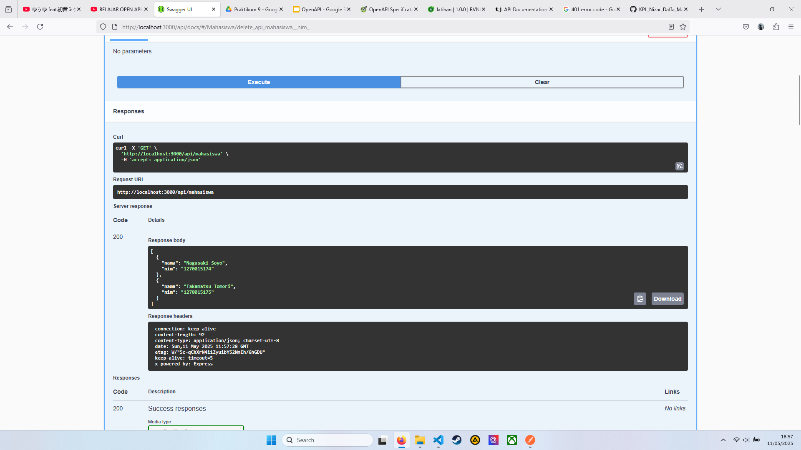
